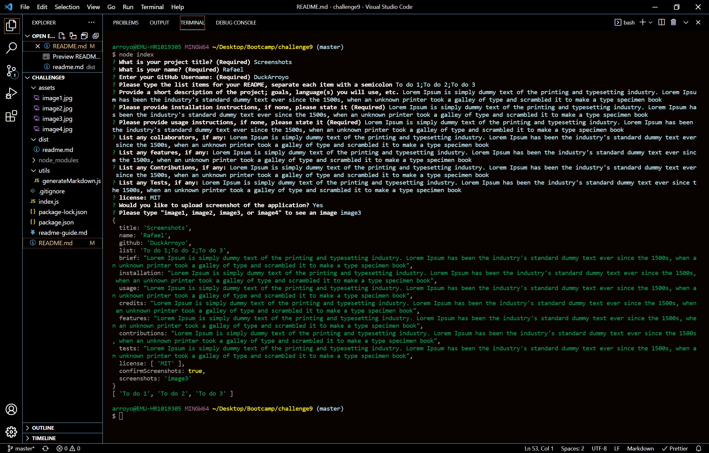

## README generator  

## UO Coding bootcamp Challenge

UO Coding bootcamp Challenge 9

## Links

This project does not have a live page.

[Github Repository](https://github.com/DuckArroyo/readmeGenerator)

## Description

This is a command line README generator. The project uses Node.js to prompt the user on a step by step process that will generate the README into the dist folder.

## Project Guidelines/Requirements

npm - npm install

inquirer - npm install inquirer

## The commandments

node index.js

## Demo video

[Walkthrough Video](https://watch.screencastify.com/v/OpmpcMLFOS9A7nBdPxMO)

## Brief

This project is a README generator. It functions through the command line with the command "node index"
The command line will ask the user for the content they wish to list in the file.

## Table of contents

- [Installation](#installation)
- [Usage](#usage)
- [Credits](#credits)
- [Features](#features)
- [Contributions](#contributions)
- [Tests](#tests)
- [License](#license)
- [Screenshot(s)](#screenshot)

## Installation

Duplicate the repository to your own machine or github account.
The application requires npm, fs, and Inquirer.js to work.

FS and Inquirer should be listed in the package-lock.json under the dependencies
Caveat, the Inquirer installation will download node_modules which is a large folder thus a gitinore is included in the files to prevent a github upload.

## Usage

Open use. This is a student project.

## Credits

## Features

# Contributions by:

DeveloperDuckArroyo

[Email](mailto:DeveloperDuckArroyo@gmail.com)

[Portfolio](https://github.com/DuckArroyo/portfolio)

[React Portfolio](http://DuckArroyo.github.io/reactPortfolio)

[GitHub](https://github.com/DuckArroyo)

[Twitter @DevDuckArroyo](https://twitter.com/DevDuckArroyo)

[LinkeIn](https://www.linkedin.com/in/duckarroyo)

[CodePen](https://codepen.io/DeveloperDuckArroyo)

## Tests

To Test the application initiate the command line with "node index"
Answer the prompts as needed.
Each iteration of the form will overwrite the previous entry.

## Screenshots

